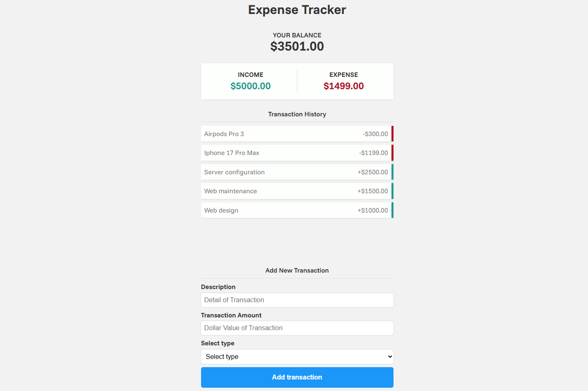
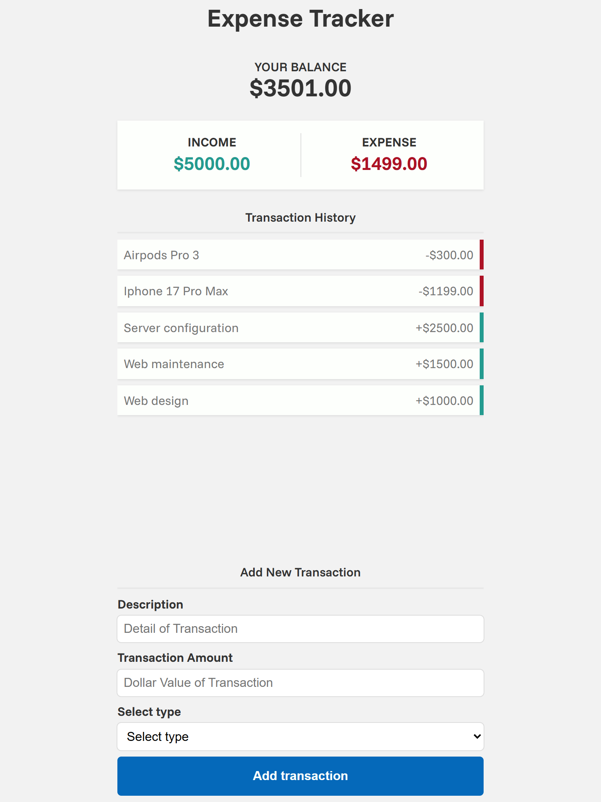
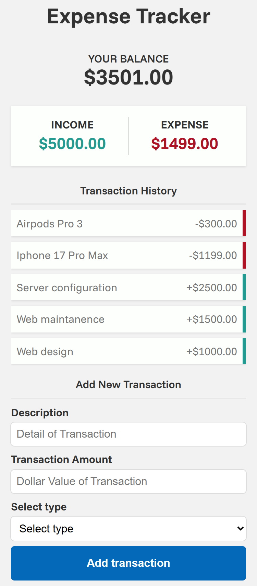

# 📊 Expense Tracker

A simple web application to track income and expenses, allowing users to visualize their balance in real time.

---

## 🚀 Demo

You can try the application here:
👉 

---

## 📸 Preview





---

## 🧠 Description

This project is an **Expense Tracker** built with **HTML, CSS, and Vanilla JavaScript**, focused on practicing:

- DOM manipulation
- Event handling
- Data structures (arrays and objects)
- Dynamic rendering
- Separation of concerns (structure, styles, and logic)

Users can add transactions (income or expense), and the app automatically calculates:

- Total balance
- Total income
- Total expenses

---

## 🛠️ Technologies Used

- HTML5
- CSS3 (with variables and modular architecture)
- JavaScript (Vanilla JS)

---

## 📂 Project Structure
```
expense-tracker/
│
├── index.html
│
├── js/
│ └── main.js
│
├── styles/
│ ├── main.css
│ ├── layout.css
│ └── components.css
│
├── assets/
│ └── previews/
│
└── README.md
```

---

## 🎨 Design Inspiration

The interface design was inspired by concepts from Dribbble.  
The goal was to replicate and adapt modern UI patterns while focusing on functionality and user experience.

Design reference: https://dribbble.com/shots/19971216-Expense-Tracker-App

---

## ⚙️ Features

- ✅ Add transactions (income / expense)  
- ✅ Input validation  
- ✅ Dynamic transaction rendering  
- ✅ Automatic balance calculation  
- ✅ Visual distinction between income and expenses  
- ✅ Empty state when no transactions exist  

---

## 📌 Future Improvements
- 💾 Save tasks in `localStorage`
- ❌ Delete transactions
- 🎨 Add animations
- Filters (income / expense)

---

## 👨‍💻 Author

Developed by **Raúl Limón**  
Frontend Developer in progress 🚀

- GitHub: [RaulLimon3](https://github.com/RaulLimon3)  
- LinkedIn: https://www.linkedin.com/in/raul-limon-garcia/